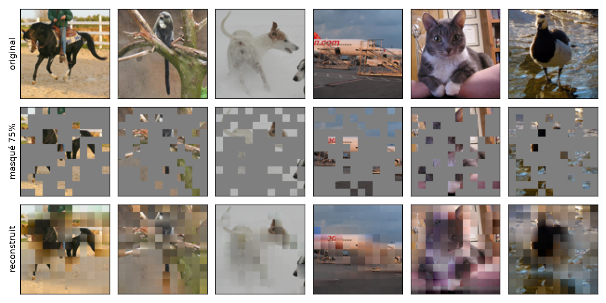
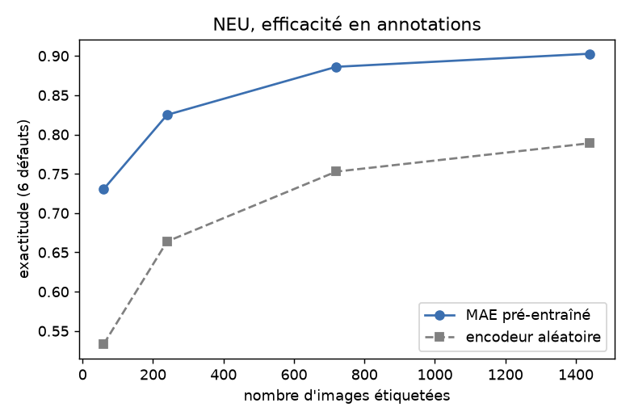

# mae-from-scratch

A Masked Autoencoder written by hand to understand the model in detail. The forward pass and
the backpropagation are derived and coded by hand, with no autograd and no torch.nn. torch is
used only as an array library, to run on the GPU. Self-supervised pretraining, then
surface-defect classification on steel (NEU) with a linear probe. Methodology study on STL-10.

Project for the introduction to computer vision course.

## Method

Patchify the image, mask a random subset of patches, encode the visible patches with a ViT
encoder, decode with a lightweight decoder, reconstruct the masked pixels. The encoder,
decoder, attention, MLP, layer norm, the loss, and Adam are all written by hand. The backward
pass of every layer is derived by hand.

## Gradient check

The hand-derived gradients are checked against central finite differences (step 1e-6), on CPU
in float64. Over the sampled parameters the worst relative error is 2.5e-6, well under the 1e-4
pass threshold. The check is in `notebook.ipynb`.

## Results

Self-supervised pretraining, then a linear probe on the frozen features. The baseline is the
same probe on a random, untrained encoder.

STL-10, linear probe accuracy:

| Encoder | Accuracy |
|---|---|
| Random | 42.2% |
| MAE (mask ratio 0.75) | 53.3% |

NEU steel surface defects, linear probe accuracy:

| Encoder | Accuracy |
|---|---|
| Random | 78.9% |
| MAE | 90.6% |

The NEU reconstruction loss goes from 3.03 to 0.85 over pretraining. Label efficiency: with 10
labels per class, the MAE probe reaches 73.1% against 53.3% for the random encoder.

Full write-up in `report/rapport.pdf`.

## Run

    python experiments_neu.py   # NEU, about 10 min CPU
    python experiments.py       # STL-10 ablation, about 1 h CPU
    python make_figures.py      # report figures

NEU data goes in `data/neu/` (otherwise from figshare). STL-10: `python scripts/datasetdwnld.py`.

## Files

- `mae.py`: the model (layers, encoder/decoder, loss, Adam).
- `train.py`: data, pretraining, linear probe, reconstruction.
- `experiments.py` / `experiments_neu.py`: STL-10 ablation / NEU case.
- `notebook.ipynb`: steps 4 to 12, tests, training, figures.
- `visualisation.ipynb`: demo, reconstruction and prediction on one image.
- `report/rapport.pdf`: the report.

## Reference

- He, Chen, Xie, Li, Dollár, Girshick. Masked Autoencoders Are Scalable Vision Learners, arXiv:2111.06377.
